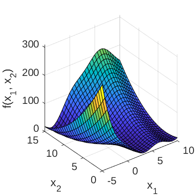
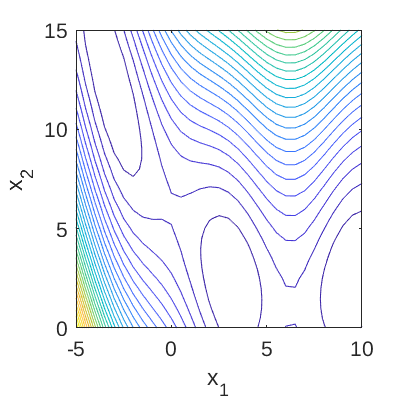

# Branin Function

[//]: # "Benchmark type: test-case"
[//]: # "Application fields: metamodeling, optimization"
[//]: # "Dimension: 2-dimension"

## Usage

The Branin function is commonly used as a test function for metamodeling, especially in the context of optimization.

## Description

The analytic expression of the Branin function is given as:

$$
f(\mathbf{x}) = a (x_2 - b x_1^2 + c x_1 - r)^2 + s (1-t) \cos{x_1} + s; \;\; x_1 \in [-5, 10], \;\; x_2 \in [0, 15]
$$

where $\mathbf{x} = \{x_1, x_2\}$ are input variables; and $a, b, c, r, s, t$ are constants.

 (Surface plot of the Branin function)

 (Contour plot of the Branin function)

## Inputs

### Random inputs

| No | Variable | Distribution | Parameters |
| - | - | - | - | - |
| 1 | $x_1$ | Uniform | $ x_{1,\min} = -5, x_{1,\max} = 10$ |
| 2 | $x_2$ | Uniform | $ x_{2,\min} = 0, x_{2,\max} = 15$ |

### Constants

The default values for the constants are shown below.

| No | Constant | Value |
| -  | -   | - |
| 1  | $a$ | $1$  |
| 2  | $b$ | $\frac{5.1}{(2 \pi)^2}$ |
| 3  | $c$ | $\frac{5}{\pi}$ |
| 4  | $r$ | $6$ |
| 5  | $s$ | $10$ |
| 6  | $t$ | $\frac{1}{8\pi}$|

## Reference Solution

Three 

## Resources

## References

