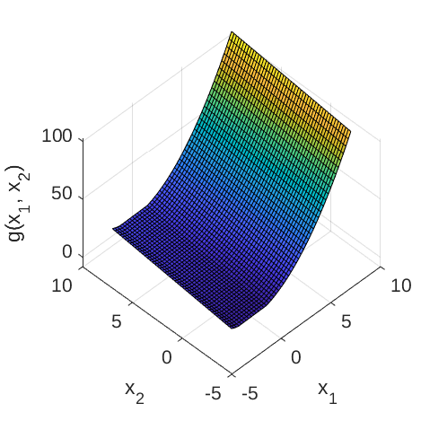
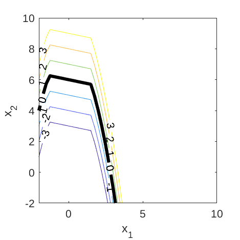
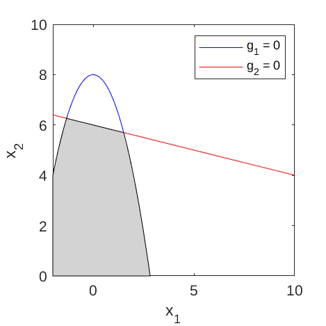

# Composite Gaussians

[//]: # "Benchmark type: test-case"
[//]: # "Application fields: metamodeling, reliability"
[//]: # "Dimension: 2-dimension"

The composite Gaussians function is a two-dimensional test function used in metamodeling and reliability analysis exercises (Bichon et al., 2011).

## Description

The composite Gaussians function consists of the following components:

$$
\begin{align}
g_1(\mathbf{x}) & = x_1^2 + x_2 - 8,\\
g_2(\mathbf{x}) & = \frac{x1}{5} + x_2 - 6,
\end{align}
$$
where $\mathbf{x} = \{x_1, x_2\}​$ are input variables.

The overall (_composite_) limit state function is defined as:

$$
g(\mathbf{x}) = \max{(g_1(\mathbf{x}), g_2(\mathbf{x}))}.
$$

Figure 1 and 2 show the surface and contour plots of the composite Gaussian function, respectively.

**Figure 1**: Surface plot of the two-dimensional Gaussians function.

**Figure 2**: Contour plot of the two-dimensional composite Gaussians function.

The failure event and the failure probability are defined as $g(\mathbf{x}) \leq 0$ and $P_f = \mathbb{P}[g(\mathbf{x}) \leq 0]$, respectively. Figure 3 shows the two limit state lines $(g_i(\mathbf{x}) = 0, \; i = 1,2)$ of the composite function and the corresponding failure domain.

**Figure 3**: Limit state lines of the composite Gaussian function. The shaded area indicates the failure domain.

## Inputs

The input variables $x_1, x_2$ are modeled as two independent Gaussian random variables.

| No | Variable | Distribution | Parameters |
| :-: | :-: | :-: | :-: | :- |
| 1 | $x_1$ | Gaussian | $\mu_{x_1} = 5.5,$ $\sigma_{x_1} = 1.0$ |
| 2 | $x_2$ | Gaussian | $\mu_{x_2} = 5.0,$ $\sigma_{x_2} = 1.0$  |

> **Note**: These values are chosen such that the failure probability is small $(\sim 10^{-4})$. In Bichon et al. (2011), the function is not used as a test function for reliability analysis method and therefore, the random inputs were not specified.

## Reference values

Some reference values for the failure probability are given in the table below.

|  Method   | $N$ |  $\hat{P}_f$   | $\text{COV}[\hat{P}_f]$ |  Source  |
| :-------: | :---------: | :--: | :------: | :------------------: |
| <abbr title="Monte Carlo simulation">MCS</abbr> | $10^{4}$    | $2.00 \times 10^{-4}$ | $70.7\%$ | UQLab v1.1 |
| MCS | $10^{5}$    | $1.00 \times 10^{-4}$ | $31.6\%$ | UQLab v1.1 |
| MCS | $10^{6}$    | $1.42 \times 10^{-4}$ | $8.4\%$ | UQLab v1.1 |
| MCS | $10^{7}$    | $1.26 \times 10^{-4}$ | $2.8\%$ | UQLab v1.1 |

## Resources

## References

* B. J. Bichon, J. M. McFarland, and S. Mahadevan, "Efficient surrogate models for system reliability analysis of systems with multiple failure modes," _Reliability Engineering and System Safety_, vol. 96, pp. 1386--1395, 2011. [DOI:10.1016/j.ress.2011.05.008](https://doi.org/10.1016/j.ress.2011.05.008)

