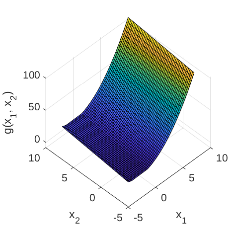
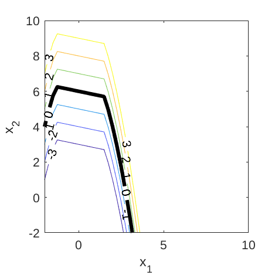
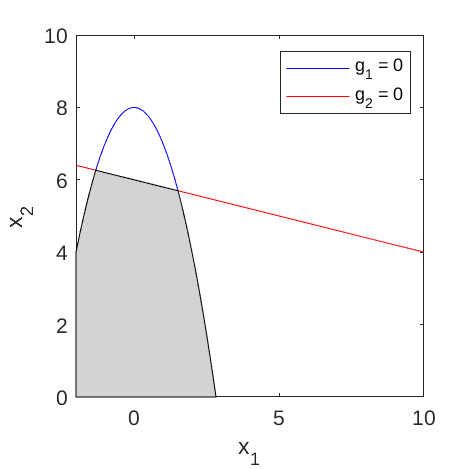

# Composite Gaussians

[//]: # "Benchmark type: test-case"
[//]: # "Application fields: metamodeling, reliability"
[//]: # "Dimension: 2-dimension"

The Composite Gaussians function is a two-dimensional test function used in metamodeling and reliability analysis exercises (Bichon et al., 2011).

## Description

The Composite Gaussians function consists of the following components:

$$
\begin{align}
g_1(\mathbf{x}) & = x_1^2 + x_2 - 8,\\
g_2(\mathbf{x}) & = \frac{x1}{5} + x_2 - 6,
\end{align}
$$
where $\mathbf{x} = \{x_1, x_2\}​$ are input variables.

The overall (_composite_) limit state function is defined as:

$$
g(\mathbf{x}) = \max{(g_1(\mathbf{x}), g_2(\mathbf{x}))}.
$$

Figure 1 and 2 show the surface and contour plots of the composite Gaussian function, respectively.

**Figure 1**: Surface plot of the two-dimensional Gaussians function.

**Figure 2**: Contour plot of the two-dimensional composite Gaussians function.

The failure event and the failure probability are defined as $g(\mathbf{x}) \leq 0$ and $P_f = \mathbb{P}[g(\mathbf{x}) \leq 0]$, respectively. Figure 3 shows the two limit state lines $(g_i(\mathbf{x}) = 0, \; i = 1,2)$ of the composite function and the corresponding failure domain.

**Figure 3**: Limit state lines of the composite Gaussian function. The shaded area indicates the failure domain.

## Inputs

The input variables $x_1, x_2$ are modeled as two independent Gaussian random variables.

| No | Variable | Distribution | Parameters |
| :-: | :-: | :-: | :-: | :- |
| 1 | $x_1$ | Gaussian | $\mu_{x_1} = 5.5,$ $\sigma_{x_1} = 1.0$ |
| 2 | $x_2$ | Gaussian | $\mu_{x_2} = 5.0,$ $\sigma_{x_2} = 1.0$  |

> **Note**: These values are chosen such that the failure probability is small $(\sim 10^{-4})$. In Bichon et al. (2011), the function is not used as a test function for reliability analysis method and therefore, the random inputs were not specified.

## Reference values

Some reference values for the failure probability are given in the table below.

|  Method   | $N$ |  $\hat{P}_f$   | $\text{COV}[\hat{P}_f]$ |  Source  |
| :-------: | :---------: | :--: | :------: | :------------------: |
| <abbr title="Monte Carlo simulation">MCS</abbr> | $10^{4}$    | $2.00 \times 10^{-4}$ | $70.7\%$ | UQLab v1.1 |
| MCS | $10^{5}$    | $1.00 \times 10^{-4}$ | $31.6\%$ | UQLab v1.1 |
| MCS | $10^{6}$    | $1.42 \times 10^{-4}$ | $8.4\%$ | UQLab v1.1 |
| MCS | $10^{7}$    | $1.26 \times 10^{-4}$ | $2.8\%$ | UQLab v1.1 |

## Resources

The vectorized implementation of the Composite Gaussians function in MATLAB as well as the script file with the model and probabilistic inputs definitions for the function in UQLAB can be downloaded below:
 
The contents of the file are:

| Filename | Description |
| :- | :- |
| `uq_compositeGaussians.m` | vectorized implementation of the Composite Gaussians function |
| `uq_Example_compositeGaussians.m` | definitions for the model and probabilistic inputs in UQLab |
| `LICENSE` | license for the function (BSD 3-Clause) |

## References

* B. J. Bichon, J. M. McFarland, and S. Mahadevan, "Efficient surrogate models for system reliability analysis of systems with multiple failure modes," _Reliability Engineering and System Safety_, vol. 96, pp. 1386--1395, 2011. [DOI:10.1016/j.ress.2011.05.008](https://doi.org/10.1016/j.ress.2011.05.008)

