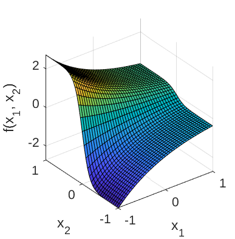
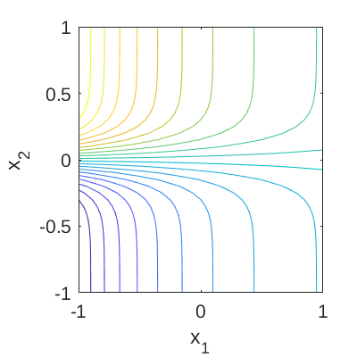

# Exp-Tanh Function

[//]: # "Benchmark type: test-function"
[//]: # "Application fields: metamodeling"
[//]: # "Dimension: 2-dimension"

In Owen et al. (2017), the Exp-Tanh function is used to test metamodeling approaches, namely polynomial chaos expansions and Gaussian process modeling.

## Description

The Exp-Tanh function is defined as:

$$
f(\mathbf{x}) = \exp{(-x_1)} \tanh{(5x_2)},\;\;\; x_1, x_2 \in [-1,1],
$$

where $\mathbf{x} = \{x_1, x_2\}$ are the input variables.

Figure 1 and 2 show the surface and contour plots of the Exp-Tanh function, respectively.

**Figure 1**: Surface plot of the Exp-Tanh function.

**Figure 2**: Contour plot of the Exp-Tanh function.

## Inputs

For computer experiment purposes, the inputs $x_1, x_2$ are modeled as two independent uniform random variables.

| No   | Variable | Distribution | Parameters                            |
| ---- | -------- | ------------ | ------------------------------------- |
| 1    | $x_1$    | Uniform      | $x_{1,\min} = -1, x_{1,\max} = 1$ |
| 2    | $x_2$    | Uniform      | $x_{2,\min} = -1, x_{2,\max} = 1$ |

## Resources

The vectorized implementation of the Exp-Tanh function in MATLAB as well as the script file with the model and probabilistic inputs definitions for the function in UQLAB can be downloaded below:

The contents of the file are:

| Filename | Description |
| :- | :- |
| `uq_expTanh.m` | vectorized implementation of the Exp-Tanh function |
| `uq_Example_expTanh.m` | definitions for the model and probabilistic inputs in UQLab |
| `LICENSE` | license for the function (BSD 3-Clause) |

## References

* N. E. Owen, P. Challenor, P. P. Menon, and S. Bennani, "Comparison of surrogate-based uncertainty quantification methods for computationally expensive simulators," _SIAM/ASA Journal on Uncertainty Quantification_, vol. 5, no. 1, pp. 403--435, 2017. [DOI:10.1137/15M1046812](https://doi.org/10.1137/15M1046812)
