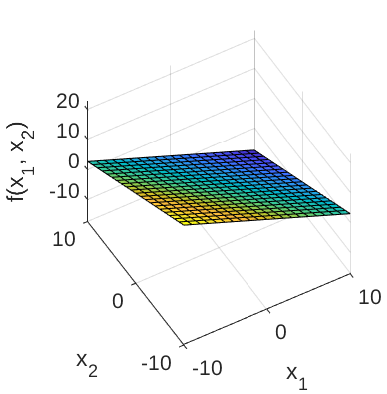
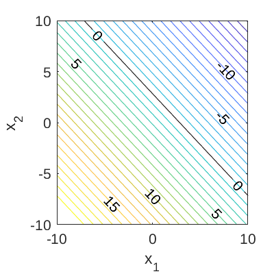

# High-dimensional Limit State Function

[//]: #	"Benchmark type: test-function"
[//]: #	"Application fields: reliability"
[//]: #	"Dimension: M-dimension"

The High-dimensional limit state function is used to test algorithms in structural reliability analysis, such as Adaptive Kriging Monte Carlo simulation (AK-MCS) and others (Rackwitz, 2001). A prominent feature of this test function is that the failure probability does not change significantly when changing the number of input dimensions.

## Description

The analytic expression of the High-dimensional limit state function is given as:

$$
g(\mathbf{x}) = \left(M + 3 a \sqrt{M}\right) - \sum_{i=1}^{M} x_i,
$$

where $M$ is the number of input variables (or dimension; positive integer); $\{x_m\}_{m=1}^{M}$ are the input variables; and $a$ is a parameter. By default, the parameter is set to $0.2$.

The failure event is defined as $g(\mathbf{x}) \leq 0$ and the failure probability $P_f = \mathbb{P}[g(\mathbf{x}) \leq 0]$. Figure 1 and 2 show the surface and contour plots of the 2-dimensional high-dimensional function using the default values of the constants, respectively.
In Figure 2, the limit state function at which $g(\mathbf{x}) = 0$ is highlighted.

**Figure 1**: Surface plot of the 2-dimensional high-dimensional limit state function.

**Figure 2**: Contour plot of the 2-dimensional high-dimensional limit state function. The limit state function at which $g(\mathbf{x})=0$ is also shown.

## Inputs

$M$ independent identically distributed lognormal random variables are considered for the high-dimensional limit state function.

| No       | Variable | Distribution | Parameters  |
| :----:   | :------: | :---------: | :------------|
| 1        | $x_1$    | Lognormal   | $\mu_{x_1} = 1,$ $\sigma_{x_1} = 0.2$ |
| $\vdots$ | $\vdots$ | $\vdots$    | $\vdots$     |
| M        | $x_M$    | Lognormal   | $\mu_{x_M} = 1,$ $\sigma_{x_M} = 0.2$ |

## Parameter

By default, the parameter $a$ is set to $0.2$ following Rackwitz (2001).

## Reference values

The asymptotic value of the failure probability $P_f$ with $M \rightarrow \infty$ is $1.35 \times 10^{-3}$ (Rackwitz, 2001). Some other values of $P_f$ calculated using different methods for different values of $M$ are shown in the table below.

|Method|$M$|$N$|$\hat{P}_f$|$\text{CoV}[\hat{P}_f]$|Source|
|:----:|:-:|:-:|:---------:|:---------------------:|:----:|
| <abbr title="First-order reliability method">FORM</abbr> |   $50$    |  $154$ | $1.531 \times 10^{-4}$ | $-$ | Rackwitz (2001) |
| <abbr title="Second-order reliability method">SORM</abbr> | $50$ |   $1'480$    | $2.555 \times 10^{-3}$ | $-$ | Rackwitz (2001) |
| <abbr title="Monte Carlo simulation">MCS</abbr> | $50$ |   $10^{6}$    | $1.915 \times 10^{-3}$ | $2.28\%$ | UQLab v1.2.1 |
| FORM | $100$ | $304$ | $3.369 \times 10^{-4}$ | $-$ | Rackwitz (2001)  |
| SORM | $100$ | $5'455$  | $2.98 \times 10^{-3}$  | $-$ | Rackwitz (2001) |
| MCS  | $100$ | $10^{6}$ | $1.685 \times 10^{-3}$ | $2.43\%$ | UQLab v1.2.1 |
| FORM | $100$ | $603$    | $6.212 \times 10^{-6}$ | $-$ | Rackwitz (2001) |
| SORM | $200$ | $20'904$ | $4.53 \times 10^{-3}$  | $-$ | Rackwitz (2001) |
| MCS  | $200$ | $10^{6}$ | $1.669 \times 10^{-3}$ | $2.45\%$ | UQLab v1.2.1 |

## Resources

The vectorized implementation of the High-dimensional limit state function in MATLAB as well as the script file with the model and probabilistic inputs definitions for the function in UQLAB can be downloaded below:

<a class="attachment" href="uq_highDimensional.zip">uq_highDimensional.zip</a>

The contents of the file are:

|Filename|Description|
|:-------|:----------|
| `uq_highDimensional.m` | vectorized implementation of the High-dimensional limit state function in MATLAB |
| `uq_Example_highDimensional.m` | definitions for the model and probabilistic inputs in UQLab |
| `LICENSE` | license for the function (BSD 3-Clause) |

## Reference

* R. Rackwitz, "Reliability analysis---a review and some perspectives," _Structural Safety_, vol. 23, no. 4, pp. 365--395, 2001. [DOI:10.1016/S0167-4730(02)00009-7](https://doi.org/10.1016/S0167-4730(02)00009-7)