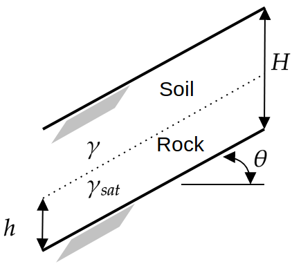

# Infinite Slope Model

[//]: # "Benchmark type: test-function"
[//]: # "Application fields: reliability"
[//]: # "Dimension: 6-dimension"

The infinite slope model is a 6-dimensional test function for reliability analysis methods. The model is used in geotechnical engineering to quantify the stability of a sloped soil under the influence of water infiltration (Phoon, 2008).

## Description

The limit state function of the infinite slope model compares the resisting force $R$ due to friction with the loading $S$ due to the soil and groundwater table.
The analytical expression of the function is given as:

$$
g = \frac{R}{S} - 1 = \frac{(\gamma (H-h) + h (\gamma_{\text{sat}}) - \gamma_w) \cos{\theta} \tan{\phi}}{(\gamma (H-h) + h \gamma_{\text{sat}}) \sin{\theta}} - 1
$$
where:

* $H$ is the depth of soil above the bedrock $[\text{m}]$;
* $h$ is the height of the groundwater table above bedrock $[\text{m}]$;
* $\gamma$ is the moist unit weight of the surface soil $[\text{kN.m}^{-3}]$
* $\gamma_{\text{sat}}$ is the saturated unit weight of the surface soil $[\text{kN.m}^{-3}]$
* $\gamma_w$ is the unit weight of water (a constant with a value of $9.81 [\text{kN.m}^{^-3}]$)
* $\phi$ is the effective stress friction angle between the rock and soil $[-]$
* $\theta$ is the slope inclination $[-]$

The configuration of the model is illustrated in Figure 1.

**Figure 1**: Illustration for the infinite slope problem, adapted from Phoon (2008).

Notice that the height of the groundwater table bedrock $h$ is limited by the depth of the soil above bedrock $H$. Furthermore, $h$ can only take positive values. Therefore, $h$ is modeled using a uniform random variable such that $h = H U_h$, where $U_h$ is a uniform random variable.

The moist and saturated soil unit weights are not independent, because they are related to the specific gravity of the soil solids $G_s$ and the void ratio $e$. The uncertainty in $\gamma$ and $\gamma_{\text{sat}}$ are characterized by modeling $G_s$ and $e$ as two independent uniform random variables. The moist and the saturated soil unit weights are computed using:
$$
\gamma = \gamma_w \frac{G_s+ke}{1+e} \;\;\; \text{and} \;\;\; \gamma_{\text{sat}} = \gamma_w \frac{G_s + e}{1 + e},
$$
respectively. $k$ is the degree of saturation of moist soil with a constant value of $0.2$.

All in all, the input variables are represented by six variables $\mathbf{x} = \{H, U_h, \phi, \theta, G_s, e\}$.

The failure event (i.e., unstable slopes) is defined as $g(\mathbf{x}) \leq 0$, that is if the resistance $R$ is smaller than the loading $S$. The failure probability, in turn, is defined as $P_f = \mathbb{P}[g(\mathbf{x}) \leq 0]$.

## Inputs

The inputs for the infinite slope model are modeled as six independent random variables described in the table below.

| No  | Variable | Distribution | Parameters | Description |
| :-: | :------: | :----------: | :--------- | :---------- |
| 1   | $H$      | Uniform   | $H_{\min} = 2,$ $H_{\max} = 8$ | Depth of soil above bedrock $[\text{m}]$ |
| 2   | $U_h$    | Uniform   | $U_{h,\min} = 0,$  $U_{h,\max} = 1$   | Relative height of water table $[-]$ |
| 3   | $\phi$   | Lognormal | $\mu_{\phi} = 0.6109,$ $\sigma_{\phi} = 0.0489$ | Effective stress friction angle $[-]$ |
| 4   | $\theta$ | Lognormal | $\mu_{\theta} = 0.3491,$ $\sigma_{\theta} = 0.0175$      | Slope inclination $[-]$ |
| 5   | $G_s$    | Uniform   | $G_{s,\min} = 2.5,$ $G_{s,\max} = 2.7$      | Specific gravity of soil $[-]$   |
| 6   | $e$      | Uniform   | $e_{\min} = 0.3,$ $e_{\max} = 0.6$  | Void ratio of soil $[-]$ |

## Reference values

Some reference values for the failure probability $P_f$ are shown in the table below.

|Method|$N$|$\hat{P}_f$|$\text{COV}[\hat{P}_f]$|Source|
|:----:|:-:|:---------:|:---------------------:|:----:|
| <abbr title="First-order reliability method">FORM</abbr> | $-$ | $7.64 \times 10^{-2}$ | $-$ | Phoon (2008) |
| <abbr title="Monte Carlo simulation">MCS</abbr>          | $-$ | $5.82 \times 10^{-2}$ | $-$ | Phoon (2008) |
| MCS          | $10^6$ | $5.78 \times 10^{-2}$ | $0.4\%$ | UQLab v1.2.1 |

## Resources

The vectorized implementation of the limit state function of the Infinite Slope model in MATLAB as well as the script file with the model and probabilistic inputs definitions for the function in UQLAB can be downloaded below:

<a class="attachment" href="uq_infiniteSlope.zip">uq_infiniteSlope.zip</a>

The contents of the file are:

|Filename|Description|
|:-------|:----------|
| `uq_infiniteSlope.m` | vectorized implementation of the limit state function of the Infinite Slope model in MATLAB |
| `uq_Example_infiniteSlope.m` | definitions for the model and probabilistic inputs in UQLab |
| `LICENSE` | license for the function (BSD 3-Clause) |

## References

* K.-K Phoon, "Numerical recipes for reliability analysis -- a primer," in _Reliability-based Design in Geotechnical Engineering: Computations and Applications_, K.-K Phoon, Ed. London: CRC Press, 2008, pp. 34--35. [DOI:10.1201/9781482265811](https://doi.org/10.1201/9781482265811)