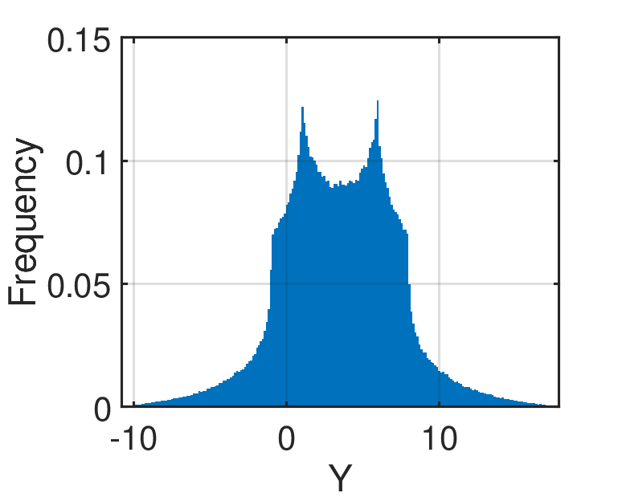

# Ishigami Function

[//]: # "Benchmark type: test-function"
[//]: # "Application fields: sensitivity, uncertainty-quantification"
[//]: # "Dimension: 3-dimension"

The Ishigami function is commonly used as a test function to benchmark global sensitivity analysis methods (Ishigami and Homma, 1990; Sobol' and Levitan, 1999; Marrel et al., 2009).

## Description

The analytic expression of the Ishigami function is given as:

$$
f(\mathbf{x}) = \sin{x_1} + a \sin^2{x_2} + b x_3^4 \sin{x_1}
$$

where $\mathbf{x} = \{x_1, x_2,x_3\} \in [-\pi, \pi]^3$ are input variables; while $a$ and $b$ are constants.

The Ishigami function is highly nonlinear and non-monotonous, particularly influenced by $x_3$.

**Figure 1**: The histogram of the Ishigami function based on $10^6$ sample points.

## Inputs

For computer experiment purposes, the inputs $x_1, x_2,x_3$ are modeled as three independent uniform random variables.

| No   | Variable | Distribution | Parameters                        |
| ---- | -------- | ------------ | --------------------------------- |
| 1    | $x_1$    | Uniform     | $x_{1,\min} = -\pi, x_{1,\max} = \pi$ |
| 2    | $x_2$    | Uniform     | $x_{2,\min} = -\pi, x_{2,\max} = \pi$ |
| 3    | $x_2$    | Uniform     | $x_{3,\min} = -\pi, x_{3,\max} = \pi$ |

## Constants

The constants of the Ishigami functions differs according to the literature shown in the table below.

| No | Constants | Value |
| :-: | :-: | :-: |
| 1 | $a = 0.7$ $b = 0.1$ | Marrel et al. (2009) |
| 2 | $a = 0.7$ $b = 0.05$ | Sobol' and Levitan (1999) |

## Reference values

### First-order Sobol' indices

The analytical solution for the first-order Sobol' indices of the Ishigami function as described above is:

* $S_1 = \frac{V_1}{\mathbb{V}[Y]}$
* $S_2 = \frac{V_2}{\mathbb{V}[Y]}$
* $S_3 = \frac{V_3}{\mathbb{V}[Y]}$

where:

* $\mathbb{V}[Y] = \frac{a^2}{8} + \frac{b\pi^4}{5} + \frac{b^2\pi^8}{18} + \frac{1}{2}$
* $V_1 = 0.5 (1 + \frac{b\pi^4}{5})^2$
* $V_2 = \frac{a^2}{8}$
* $V_3 = 0$

### Total-effect Sobol' indices

The analytical solution for the total-effect Sobol' indices of the Ishigami function as described above is:

* $S_{T1} = \frac{V_{T1}}{\mathbb{V}[Y]}$
* $S_{T2} = \frac{V_{T2}}{\mathbb{V}[Y]}$
* $S_{T3} = \frac{V_{T3}}{\mathbb{V}[Y]}$

where:

* $V_{T1} = 0.5 (1 + \frac{b\pi^4}{5})^2 + \frac{8b^2\pi^8}{225}$
* $V_{T2}= \frac{a^2}{8}$
* $V_{T3} = \frac{8b^2\pi^8}{225}$

## Resources

## References

* T. Ishigami and T. Homma, "An importance quantification technique in uncertainty analysis for computer models," In _the First International Symposium on Uncertainty Modeling and Analysis_, Maryland, USA, Dec. 3--5, 1990.  [DOI: 10.1109/ISUMA.1990.151285](https://doi.org/10.1109/ISUMA.1990.151285)
* I. M. Sobol' and Y. L. Levitan, "On the use of variance reducing multipliers in Monte Carlo computations of a global sensitivity index," _Computer Physics Communications_, vol. 117, no. 1, pp. 52--61, 1999. [DOI:10.1016/S0010-4655(98)00156-8](https://doi.org/10.1016/S0010-4655(98)00156-8)
* A. Marrel, B. Iooss, B. Laurent, O. Roustant, "Calculatons of Sobol indices for the Gaussian process metamodel," _Reliability Engineering & System Safety_, vol. 94, no. 3, pp. 742--751, 2009. [DOI:10.1016/j.ress.2008.07.008](https://doi.org/10.1016/j.ress.2008.07.008)
