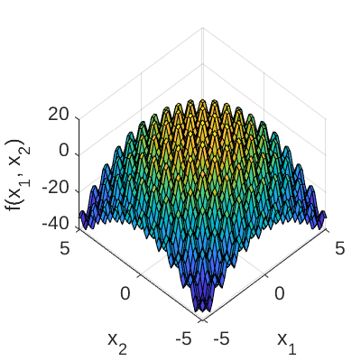
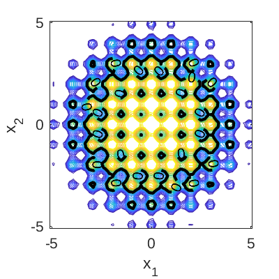

# Modified Rastrigin Function

[//]: # "Benchmark type: test-function"
[//]: # "Application fields: reliability"
[//]: # "Dimension: 2-dimension"

The 2-dimensional modified Rastrigin function is a test function for reliability analysis algorithms (Echard et al., 2011). It is a modification of the Rastrigin function (Mühlenbein et al. 1991) to include positive and negative values (i.e., safe and failed points, respectively). It features a highly non-linear limit state function with non-convex and non-connex failure domains (Echard et al., 2011).

## Description

The analytic expression of the modified Rastrigin function is given as:

$$
g(\mathbf{x}) = 10 - \sum_{m=1}^2 (x_m^2 - 5 \cos{(2 \pi x_m)})
$$

where $\mathbf{x} = \{x_1, x_2\}$ is the vector of input variables.

The failure event and the failure probability are defined as $g(\mathbf{x}) \leq 0$ and $P_f = \mathbb{P}[g(\mathbf{x}) \leq 0]$, respectively. Figure 1 and 2 show the surface and contour plots of the modified Rastrigin function, respectively. In Figure 2, the limit state function $g(\mathbf{x}) = 0$ is highlighted.

**Figure 1**: Surface plot of the modifiedRastriginfunction.

**Figure 2**: Contour plot of the modified Rastrigin function. The limit state function $g(\mathbf{x}=0)$ is highlighted.

## Inputs

The inputs $x_1$ and $x_2$ are modeled as two independent standard Gaussian random variables.

| No |Variable|Distribution|Parameters|
|:--:|:------:|:----------:|:--------:|
| 1  | $x_1$  | Gaussian   | $\mu_{x_1} = 0$, $\sigma_{x_1} = 1.0$ |
| 2  | $x_2$  | Gaussian   | $\mu_{x_2} = 0$, $\sigma_{x_2} = 1.0$ |

## Reference values

Some reference values for the failure probability $P_f$ are given in the table below.

|Method|$N$|$\hat{P}_f$|$\text{COV}[\hat{P}_f]$|Source|
|:----:|:-:|:---------:|:---------------------:|:----:|
| <abbr title="Monte Carlo simulation">MCS</abbr> | $6 \times 10^4$ | $7.34 \times 10^{-2}$ | $1.5\%$ | Echard et al. (2011) |
| MCS  |   $10^6$   | $7.31 \times 10^{-2}$ | $0.36\%$ | UQLab v1.2.1 |
| Subset simulation | $5'000$ | $7.65 \times 10^{-2}$ | $-$ | Echard et al. (2011) |

## Resources

The vectorized implementation of the modified Rastrigin in MATLAB as well as the script file with the model and probabilistic inputs definitions for the function in UQLAB can be downloaded below:

<a class="attachment" href="uq_modifiedRastrigin.zip">uq_modifiedRastrigin.zip</a>

The contents of the file are:

|Filename|Description|
|:-------|:----------|
| `uq_modifiedRastrigin.m` | vectorized implementation of the modified Rastrigin function in MATLAB |
| `uq_Example_modifiedRastrigin.m` | definitions for the model and probabilistic inputs in UQLab |
| `LICENSE` | license for the function (BSD 3-Clause) |

## References

* H. Mühlenbein, M. Schomisch, and J. Born, "The parallel genetic algorithm as function optimizer," Parallel Computing, vol. 17, pp. 619--632, 1991. [DOI:10.1016/S0167-8191(05)80052-3](https://doi.org/10.1016/S0167-8191(05)80052-3)
* B. Echard, N. Gayton, and M. Lemaire, "AK-MCS: An active learning reliability method combining Kriging and Monte Carlo Simulation," Structural Safety, vol. 33, pp. 145--154, 2011. [DOI:10.1016/j.strusafe.2011.01.002](https://doi.org/10.1016/j.strusafe.2011.01.002)