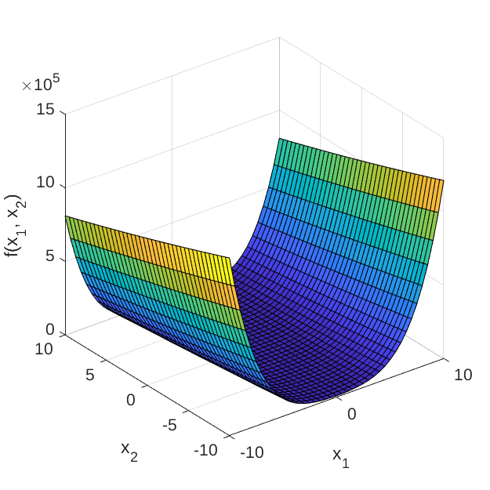
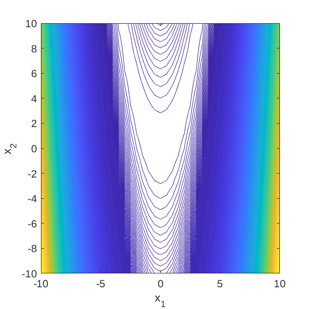

# Rosenbrock Function

[//]: # "Benchmark type: test-function"
[//]: # "Application fields: optimization"
[//]: # "Dimension: M-dimension"

The Rosenbrock function, also known as the _valey_ or _banana_ function, is commonly used as a test function for optimization algorithms, particularly for gradient-based algorithms since convergence towards its optimum is rather challenging.

## Description

The analytic expression of the Rosenbrock function is given as:

$$
f(\mathbf{x}) = \sum_{m=1}^{M-1}\left[ 100 (x_{m+1} - x_m^2)^2 + (x_m - 1)^2 \right],
$$

where $\mathbf{x} = \{x_m,\}_{m=1}^{M}$ are input variables; and $M$ is a positive integer.

Figure 1 and 2 show the surface and contour plots of the 2-dimensional Rosenbrock function evaluated at $\mathbf{x} \in [-10, 10]^2​$.

**Figure 1**: Surface plot of the 2-dimensional Rosenbrock function. 

**Figure 2**: Contour plot of the 2-dimensional Rosenbrock function.

## Inputs

The function is typically evaluated on the hypercube $\mathbf{x} \in [-5, 10]^M$. For computer experiment purposes, the input variables are modeled as independent uniform random variables.

| No   | Variable | Distribution | Parameters                          |
| ---- | -------- | ------------ | ----------------------------------- |
| 1    | $x_1$    | Uniform      | $x_{1,\min} = -5, x_{1,\max} = 10$ |
| $\vdots$    | $\vdots$    | $\vdots$      | $\vdots$ |
| M    | $x_M$    | Uniform      | $x_{2,\min} = -5, x_{2,\max} = 10$ |

## Analytical values

The Rosenbrock function is a unimodal function and its global minimum, $f(\mathbf{x}^*) = 0$ is located at $\mathbf{x}^* = (1, \ldots, 1)$.

## Resources

## References

* A. Forrester, A. Sóbester, and A. Keane, _Engineering Design via Surrogate Modelling: A Practical Guide_, West Sussex: John Wiley & Sons Ltd., 2008, pp. 196-197. [DOI:10.1002/9780470770801](https://doi.org/10.1002/9780470770801)
* V. Picheny, T. Wagner, and D. Ginsbourger, "A benchmark of kriging-based infill criteria for noisy optimization," _HAL_, hal-00658212, 2012. [URL](https://hal.archives-ouvertes.fr/hal-00658212/document)