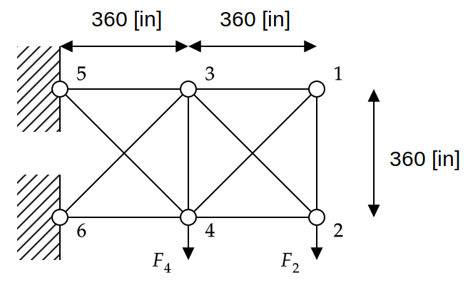

# Ten-Bar Truss Problem

[//]: # "Benchmark type: test-function"
[//]: # "Application fields: reliability"
[//]: # "Dimension: 10-dimension"

The ten-bar truss problem is a 10-dimensional test problem for reliability analysis methods (Wei and Rahman 2007).

## Description

The configuration of the ten-bar truss structure is given in Figure 1.

**Figure 1**: Configuration of the ten-bar truss structure

The truss structure consists of six nodes and ten bars. The truss structure is subjected to two vertical loads. The reliability analysis is conducted for the vertical deflection at node 2 with the cross section areas of the bars are taken to be uncertain.

The deterministic parameters of the problems are:

* Young's modulus of all bars ($E = 10^7 [\text{psi}]$)
* Loads $F_1 = F_4 = 10^5 [\text{lb}]$

## Inputs

The 10 cross section areas of the bars are modeled as independent identically distributed truncated Gaussian random variables described in the table below.

| No  | Variable | Distribution | Parameters | Description |
| :-: | :------: | :----------: | :---------: | :---------- |
| 1        | $A_1$    | Truncated Gaussian | $\mu_{A_1} = 2.5,$ $\sigma_{A_1} = 0.5,$ $A_{1,\min} = 10^{-5},$ $A_{1,\max} = +\infty$ | Cross section are of bar 1 $[\text{in}^2]$|
| $\vdots$ | $\vdots$ | $\vdots$       | $\vdots$                                  | $\vdots$ |
| 10       | $A_{10}$ | Truncated Gaussian | $\mu_{A_{10}} = 2.5,$ $\sigma_{A_{10}}= 0.5,$ $A_{10,\min} = 10^{-5},$ $A_{10,\max} = +\infty$ | Cross section area of bar 10 $[\text{in}^2]$|

## Resources

## References

* D. Wei and S. Rahman, "Structural reliability analysis by univariate decomposition and numerical integration," _Probabilistic Engineering Mechanics_, vol. 22, pp. 27--38, 2007. [DOI:10.1016/j.probengmech.2006.05.004](https://doi.org/10.1016/j.probengmech.2006.05.004)
